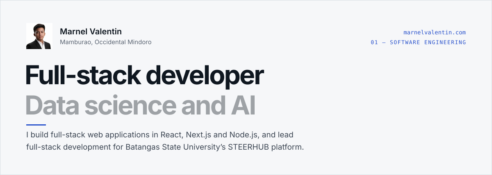

<a href="https://me.mvsoftwares.space">
  <picture>
    <source media="(prefers-color-scheme: dark)" srcset="./assets/lens-data-ai.svg">
    <source media="(prefers-color-scheme: light)" srcset="./assets/lens-software.svg">
    
  </picture>
</a>

  
  
  
  

  
    <a href="#about">About</a> &nbsp;·&nbsp;
    <a href="#01--software-engineering">Software engineering</a> &nbsp;·&nbsp;
    <a href="#02--data-science-and-ai">Data science and AI</a> &nbsp;·&nbsp;
    <a href="#experience">Experience</a> &nbsp;·&nbsp;
    <a href="#education">Education</a> &nbsp;·&nbsp;
    <a href="#training">Training</a> &nbsp;·&nbsp;
    <a href="#activity">Activity</a> &nbsp;·&nbsp;
    <a href="#contact">Contact</a>
  

---

## About

I am Mhar Nhel Valentin, a 25-year-old web developer and data science enthusiast currently pursuing a Master of Science in Data Science. I hold a Bachelor of Science in Information Technology and have extensive experience building full-stack web applications. My skill set spans modern web technologies, backend APIs, and data analysis — including forecasting and exploratory analysis using Python with Jupyter and R with RStudio. I also practice AI-assisted development using tools like Claude Code, Cursor, and Codex — leveraging AI to ship faster and smarter.

| Currently | |
|:--|:--|
| **University Research Associate I (Full Stack Web Developer)** | Batangas State University - STEERHUB · since Nov 2024 |
| **Master of Science in Data Science** | Batangas State University - TNEU · since 2025 |
| **Freelance Web Developer** | Remote · since Oct 2023 |
| **Mhar - AI Agent Web Extension** | Ollama and Llama 3.2 · since Apr 2025 |

📍 Mamburao, Occidental Mindoro

 

## 01 — Software engineering

I build full-stack web applications in React, Next.js and Node.js, and lead full-stack development for Batangas State University’s STEERHUB platform.

| | |
|:--|:--|
| **Languages** |    |
| **Frontend** |    |
| **State & data fetching** |    |
| **Backend** |   |
| **Databases & BaaS** |      |
| **Infrastructure** |    |

### Projects

#### [uShop - BatStateU University Shop for LIMA Campus](https://steerhub.store)
December 2024 - January 2025 · [steerhub.store](https://steerhub.store)

A multi-vendor e-commerce web application that allows users to buy and sell items on the Batangas State University campus.

`Next.js` `MySQL` `Sequelize` `TailwindCSS` `Shadcn UI` `Tanstack Query` `Typescript`

#### [TRIOE](http://trioe.dev)
November 2024 - Present · [trioe.dev](http://trioe.dev)

A website platform for the Batangas State University's TRIOE initiative.

`Next.js 15` `MySQL` `Sequelize` `TailwindCSS` `Shadcn UI` `Tanstack Query` `Typescript`

 

## 02 — Data science and AI

I do exploratory analysis and forecasting in Python with Jupyter and R with RStudio, and AI integration such as RAG and LLM fine‑tuning, while studying for a Master of Science in Data Science.

| | |
|:--|:--|
| **Languages & environments** |     |
| **Analysis** |   |
| **AI & LLMs** |    |
| **AI-assisted development** |    |

### Projects

#### [Mhar - AI Agent Web Extension](https://github.com/Marnel8/oracle)
April 2025 - Present · [Source](https://github.com/Marnel8/oracle)

A web extension that allows users to interact with AI agents on any website.

`HTML` `CSS` `Javascript` `Ollama` `Llama 3.2`

 

## Other tools

  

 

## Experience

#### University Research Associate I (Full Stack Web Developer)
**[Batangas State University - STEERHUB](https://batstateu.edu.ph/)** · Alangilan, Batangas City, Batangas · November 2024 – Present

Leading full-stack development for Batangas State University's STEERHUB platform, supporting the TRIOE initiative in research collaboration and resource management.

#### Web Developer
**Freelance** · Remote · October 2023 – Present

Developed and deployed various full-stack web applications for clients using modern technologies. Implemented responsive front-end designs with React and Next.js, built robust back-end APIs using Node.js and Express, and integrated PostgreSQL databases. Utilized Git for version control and deployed applications on cloud platforms like Vercel and Heroku.

#### Layout Artist
**MPMPC** · Mamburao, Occidental Mindoro · October 2023 – November 2024

Design and Layout Posters, Flyers, and other promotional materials for the Mindoro Progressive Multi-Purpose Cooperative (MPMPC).

#### Software Developer Intern
**[Batangas State University - DTC Intern](https://batstateu.edu.ph/)** · Alangilan, Batangas City, Batangas · Feb 2023 – May 2023

Developed a frontend user interface for Web and Mobile Projects of the Digital Transformation Center (DTC) and collaborate with the other intern and staffs.

 

## Education

| Degree | School | Years |
|:--|:--|:--|
| **Master of Science in Data Science** | [Batangas State University - TNEU](https://batstateu.edu.ph/) | 2025 – Present |
| **Bachelor of Science in Information Technology** | [Batangas State University - TNEU](https://batstateu.edu.ph/) | 2019 – 2023 |

 

## Training

After graduating, I joined training programs to deepen my software engineering and cloud computing fundamentals.

| Program | Dates | Where | |
|:--|:--|:--|:--|
| **Basic Software Engineering** | Feb 02 2024 - Feb 03 2024 | Remote (Cast LMS) | [Certificate](https://drive.google.com/file/d/1jFZakc_Tf_HMhbYxVLT_p8SO3Il-h0EV/view?usp=drive_link) |
| **Intermediate Software Engineering** | Feb 07 2024 - Feb 09 2024 | Remote (DICT Cast LMS) | [Certificate](https://drive.google.com/file/d/18qIlP0kEF5CbraLRvvBGboudxttCKa89/view?usp=drive_link) |
| **Advanced Software Engineering** | Feb 16 2024 - Feb 18 2024 | Remote (DICT Cast LMS) | [Certificate](https://drive.google.com/file/d/1AlXrfEurvkz_PGnCuABSEwm2wZMQsPGp/view?usp=drive_link) |
| **Basic level of Cloud Computing** | Feb 27 2024 - Mar 01 2024 | Remote (DICT Cast LMS) | [Certificate](https://drive.google.com/file/d/1XnVPM2eD4pNTIbtLPRq1OBAtahCEXusy/view?usp=drive_link) |

 

## Activity

<picture>
  <source media="(prefers-color-scheme: dark)" srcset="https://github-readme-stats.vercel.app/api?username=marnel8&show_icons=true&count_private=true&border_radius=8&bg_color=0F2326&title_color=E6F2EF&text_color=B7CCC8&icon_color=6FE0BF&border_color=2C4A49">
  
</picture>
<picture>
  <source media="(prefers-color-scheme: dark)" srcset="https://github-readme-stats.vercel.app/api/top-langs/?username=marnel8&layout=compact&border_radius=8&bg_color=0F2326&title_color=E6F2EF&text_color=B7CCC8&border_color=2C4A49">
  
</picture>

<picture>
  <source media="(prefers-color-scheme: dark)" srcset="https://streak-stats.demolab.com?user=marnel8&border_radius=8&background=0F2326&border=2C4A49&stroke=2C4A49&ring=6FE0BF&fire=B9A6FF&currStreakNum=E6F2EF&sideNums=E6F2EF&currStreakLabel=6FE0BF&sideLabels=B7CCC8&dates=8EA9A4">
  
</picture>

 

## Contact

| | |
|:--|:--|
| **Email** | [mharnhelvalentin@gmail.com](mailto:mharnhelvalentin@gmail.com) |
| **Website** | [me.mvsoftwares.space](https://me.mvsoftwares.space) |
| **CV** | [resume.pdf](https://me.mvsoftwares.space/resume.pdf) |
| **LinkedIn** | [in/mharnhel-valentin](https://www.linkedin.com/in/mharnhel-valentin) |
| **X** | [@Tiomarrr](https://x.com/Tiomarrr) |
| **Facebook** | [Marnel.Valentin.02](https://web.facebook.com/Marnel.Valentin.02/) |

The banner follows your GitHub theme: light shows the software lens, dark shows the data science and AI lens, just like the switch on <a href="https://me.mvsoftwares.space">me.mvsoftwares.space</a>.
